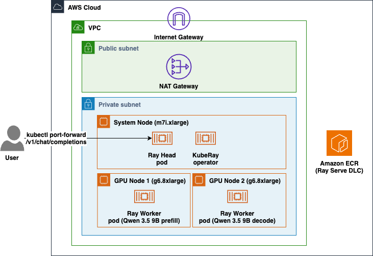

# Multi-Node Ray Serve on EKS

Deploy a single LLM across **two GPU nodes** with Ray Serve on Amazon EKS, using AWS DLCs. This sample demonstrates **prefill/decode (PD) disaggregation**: one node handles the prefill phase and the other handles decode, cooperating behind a single endpoint.

Ray is a distributed compute framework, so most Ray Serve deployments are multi-node by nature. Common patterns include tensor/pipeline parallelism (shard a model too big for one instance), data parallelism (replicate a model for throughput), and prefill/decode disaggregation (separating the two phases of inference onto different nodes).

## What this sample builds

The scripts will deploy [`Qwen/Qwen3.5-9B`](https://huggingface.co/Qwen/Qwen3.5-9B) in 2 `g5.xlarge` worker nodes: one for prefill and one for decode. The prefill node builds the KV cache for the prompt and hands it to the decode node over [NIXL](https://docs.ray.io/en/latest/serve/llm/user-guides/prefill-decode.html), which generates the response. Each phase runs the full model on its own GPU and scales independently.

The [ray-llm DLC](https://aws.github.io/deep-learning-containers/ray-llm/) ships vLLM, Ray Serve LLM, and NIXL, and exposes an **OpenAI-compatible API** with no application code. The entire app in this sample is a block of YAML.

## Architecture



## Prerequisites

Install the following tools before running any scripts:

- [AWS CLI](https://docs.aws.amazon.com/cli/latest/userguide/install-cliv2.html) with credentials configured
- [eksctl](https://eksctl.io/installation/)
- [kubectl](https://kubernetes.io/docs/tasks/tools/)
- [helm](https://helm.sh/docs/intro/install/) to install the KubeRay operator
- [envsubst](https://www.gnu.org/software/gettext/) is used to render the manifest

Verify that your AWS credentials are active:

```bash
aws sts get-caller-identity
```

## Directory Structure

```
ray-serve-multi-node/
      scripts/      # Deployment and teardown scripts for EKS, node group, KubeRay, and the RayService
      manifest/     # KubeRay RayService manifest: the entire application
```

## Configuration

All scripts share a single configuration file: `scripts/env.sh`. Override any variable by exporting it before running a script.

| Variable | Default | Description |
| --- | --- | --- |
| CLUSTER_NAME | eks-cluster | EKS cluster name |
| REGION | us-east-2 | AWS region |
| K8S_VERSION | 1.35 | Kubernetes version |
| SYSTEM_NODE_TYPE | m7i.xlarge | Instance type for system/head nodes |
| SYSTEM_NODE_COUNT | 1 | Number of system nodes |
| GPU_NODE_TYPE | g5.xlarge | GPU worker instance type |
| GPU_NODE_COUNT | 2 | Number of GPU nodes (prefill + decode) |
| GPU_NODEGROUP_NAME | gpu-workers | Name of the GPU node group |
| DLC_IMAGE | 763104351884.dkr.ecr.${REGION}.amazonaws.com/ray:serve-llm-cuda-v1.0 | Ray Serve LLM DLC image |
| KUBERAY_VERSION | 1.4.0 | KubeRay operator version |
| RAY_VERSION | 2.58.0 | Ray version |
| RAY_SERVICE_NAME | ray-llm | Name of the RayService |
| NAMESPACE | inference | Kubernetes namespace |
| MODEL_ID | qwen3.5-9b | Model id exposed on the API |
| MODEL_SOURCE | Qwen/Qwen3.5-9B | Hugging Face model source |

## Pre-Deployment setup

### Step 1: Setup variables

Go to the root directory of the project. Then run this command:

```bash
CURRENT_DIR=$(pwd)
```

### Step 2: Setup export variables

```bash
cd $CURRENT_DIR/ray-serve-multi-node/scripts
source ./env.sh
```

## The application

There is no Python to write. The application is the `serveConfigV2` block in `manifest/rayservice.yaml`. It uses `build_pd_openai_app`, which takes a `prefill_config` and a `decode_config` and wires the KV-cache transfer between them:

```yaml
applications:
  - name: qwen
    import_path: ray.serve.llm:build_pd_openai_app   # OpenAI-compatible PD app, built in
    route_prefix: /
    args:
      prefill_config:
        model_loading_config: { model_id: qwen3.5-9b, model_source: Qwen/Qwen3.5-9B }
        engine_kwargs:
          kv_transfer_config: { kv_connector: NixlConnector, kv_role: kv_both, engine_id: prefill }
        deployment_config: { num_replicas: 1 }
      decode_config:
        model_loading_config: { model_id: qwen3.5-9b, model_source: Qwen/Qwen3.5-9B }
        engine_kwargs:
          kv_transfer_config: { kv_connector: NixlConnector, kv_role: kv_both, engine_id: decode }
        deployment_config: { num_replicas: 1 }
```

Ray Serve places the prefill and decode deployments on the two GPU workers, so the two phases run on two different nodes and exchange the KV cache over NIXL.

## Step-by-step deployment

```bash
cd $CURRENT_DIR/ray-serve-multi-node/scripts
```

### Step 1: Create the EKS cluster

```bash
./deploy_cluster.sh
```

Provisions the EKS cluster (VPC, OIDC, core add-ons) and a CPU **system** node group (`m7i.xlarge`) that runs system workloads, the KubeRay operator, and the Ray head. Nodes run in private subnets with outbound access through a NAT Gateway. Idempotent: safe to re-run if interrupted. 15-20 minutes on a fresh run.

### Step 2: Add GPU worker nodes

```bash
./deploy_node_group.sh
```

Creates the GPU node group. By default 2x `g5.xlarge`, labeled `role=gpu-worker` so the Ray workers target them via a `nodeSelector`. Runs in private subnets with no public IPs. 3-5 minutes.

### Step 3: Install the KubeRay operator

```bash
./install_kuberay.sh
```

Installs the KubeRay operator via Helm. KubeRay watches the `RayService` you apply next and wires the head-to-worker join automatically. Idempotent. 1-2 minutes.

### Step 4: Deploy the RayService

```bash
./deploy_ray_service.sh
```

Renders `manifest/rayservice.yaml` with your image/model/naming variables and applies it. KubeRay creates the head and two worker pods, and Ray Serve LLM brings up the prefill and decode deployments. The script waits for the head to be Ready, both workers to be Running, and finally for the Serve app to report `RUNNING`. Because each node loads the model, expect several minutes here.

### Check status

```bash
./deploy_ray_service.sh status
```

Shows the RayService state, the head + worker pods (with the node each landed on), and GPU capacity.

## Invoke the model

Port-forward to the Serve endpoint. KubeRay creates a stable `<rayservice-name>-serve-svc` Service once the Serve app is healthy:

```bash
kubectl port-forward -n inference svc/ray-llm-serve-svc 8000:8000
```

List models:

```bash
curl --silent http://127.0.0.1:8000/v1/models
```

Chat completion:

```bash
curl --fail --silent --show-error \
  --request POST "http://127.0.0.1:8000/v1/chat/completions" \
  --header "Content-Type: application/json" \
  --data '{
    "model": "qwen3.5-9b",
    "messages": [
      {"role": "user", "content": "Explain the benefits of prefill/decode disaggregation."}
    ],
    "max_tokens": 200,
    "temperature": 0.7
  }'
```

## Teardown (reverse order)

```bash
cd $CURRENT_DIR/ray-serve-multi-node/scripts
```

### Delete the RayService

```bash
./delete_ray_service.sh
```

### Uninstall the KubeRay operator

```bash
./install_kuberay.sh cleanup
```

### Delete the GPU node group

```bash
./delete_node_group.sh
```

### Delete the EKS cluster

```bash
./delete_cluster.sh
```

## Scripts Quick Reference

| Action | Command |
| --- | --- |
| Deploy cluster | `./deploy_cluster.sh` |
| Deploy GPU nodes | `./deploy_node_group.sh` |
| Install KubeRay | `./install_kuberay.sh` |
| Deploy RayService | `./deploy_ray_service.sh` |
| Check status | `./deploy_ray_service.sh status` |
| Delete RayService | `./delete_ray_service.sh` |
| Uninstall KubeRay | `./install_kuberay.sh cleanup` |
| Delete GPU nodes | `./delete_node_group.sh` |
| Delete EKS cluster | `./delete_cluster.sh` |