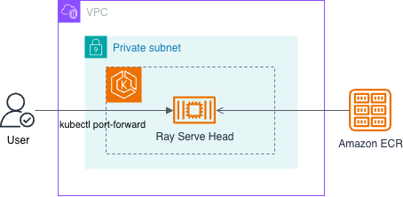

# Ray Serve on EKS

Deploy Ray Serve on Amazon EKS with a single GPU node using AWS Deep Learning Containers.

## Architecture



## Prerequisites

Install the following tools before running any scripts:

- [AWS CLI](https://docs.aws.amazon.com/cli/latest/userguide/install-cliv2.html) (with credentials configured)
- [eksctl](https://eksctl.io/installation/)
- [kubectl](https://kubernetes.io/docs/tasks/tools/)

Verify that your AWS credentials are active:

```bash
aws sts get-caller-identity
```

## Directory Structure

```
ray-serve-single-node-dlc/
      scripts/      # Deployment and teardown scripts for EKS Cluster, Node Groups, and Ray Serve Deployment
      manifest/     # Kubernetes manifests (Deployment YAML)
      code/         # Application to serve Qwen model for inference
```

## Configuration

All scripts share a single configuration file: `scripts/env.sh`. Override any variable by exporting it before running a script.

| Variable | Default | Description |
|----------|---------|-------------|
| CLUSTER_NAME | eks-cluster | EKS cluster name |
| REGION | us-west-2 | AWS region |
| K8S_VERSION | 1.35 | Kubernetes version |
| SYSTEM_NODE_TYPE | m7i.xlarge | Instance type for system nodes |
| SYSTEM_NODE_COUNT_PER_AZ | 1 | System nodes per availability zone |
| GPU_NODE_TYPE | g5.xlarge | Instance type for GPU worker nodes |
| GPU_NODE_COUNT | 1 | Number of GPU nodes |
| GPU_NODEGROUP_NAME | gpu-workers | Name of the GPU node group |
| DLC_IMAGE | $ACCOUNT_ID.dkr.ecr.$AWS_REGION.amazonaws.com/ray-serve-qwen | Ray DLC container image |
| RAY_CLUSTER_NAME | ray-cluster | Name of the Deployment |
| NAMESPACE | inference | Kubernetes namespace for Ray Serve pod |

## Pre-Deployment setup

### Step 1: Setup variables

Go to the root directory of the project. Then run this command:

```bash
CURRENT_DIR=$(pwd)
```

### Step 2: Setup export variables

Run this command to setup export variables

```bash
cd $CURRENT_DIR/ray-serve-single-node-dlc/scripts
source ./env.sh
```

## Build Docker Image for Deployment

The application we're containerizing is a Ray Serve deployment that loads the Qwen3-VL-2B vision-language model onto a GPU-powered instance and exposes it as an HTTP endpoint. When a request arrives with an image URL and a text prompt, the model generates a natural-language response describing or answering questions about the image.

Here's the core of `code/qwen_serve.py`:

```python
@serve.deployment(ray_actor_options={"num_gpus": 1})
class QwenVLService:
    def __init__(self):
        model_name = "Qwen/Qwen3-VL-2B-Instruct"
        self.processor = AutoProcessor.from_pretrained(model_name)
        self.model = AutoModelForImageTextToText.from_pretrained(
            model_name, torch_dtype=torch.float16
        ).to("cuda")

    async def __call__(self, request):
        body = await request.json()
        # ... builds a chat message, runs inference, returns {"response": output}

app = QwenVLService.bind()
```

To build the Docker image we'll upload the source to S3 and kick off an AWS CodeBuild job. This avoids needing a local GPU or Docker daemon with GPU support.

### Create the S3 bucket

```bash
export AWS_REGION=us-west-2
export ACCOUNT_ID=$(aws sts get-caller-identity --query Account --output text)
export S3_BUCKET=ray-serve-qwen-code-${ACCOUNT_ID}

aws s3 mb s3://$S3_BUCKET --region $AWS_REGION
```

### Package and upload code

```bash
cd $CURRENT_DIR/ray-serve-single-node-dlc/code
```

```bash
rm ray-serve-qwen-code.zip
zip -r ray-serve-qwen-code.zip Dockerfile qwen_serve.py requirements.txt buildspec.yml
aws s3 cp ray-serve-qwen-code.zip s3://$S3_BUCKET/ray-serve-qwen-code.zip
```
### Create the CodeBuild service role

* Create the IAM role
* Attach policies: ECR push, CloudWatch Logs, S3 read
* Get the role ARN

```bash
cat > /tmp/codebuild-trust-policy.json << 'EOF'
{
  "Version": "2012-10-17",
  "Statement": [
    {
      "Effect": "Allow",
      "Principal": {
        "Service": "codebuild.amazonaws.com"
      },
      "Action": "sts:AssumeRole"
    }
  ]
}
EOF

aws iam create-role \
  --role-name ray-serve-codebuild-role \
  --assume-role-policy-document file:///tmp/codebuild-trust-policy.json

aws iam attach-role-policy \
  --role-name ray-serve-codebuild-role \
  --policy-arn arn:aws:iam::aws:policy/AmazonEC2ContainerRegistryPowerUser

aws iam attach-role-policy \
  --role-name ray-serve-codebuild-role \
  --policy-arn arn:aws:iam::aws:policy/CloudWatchLogsFullAccess

aws iam attach-role-policy \
  --role-name ray-serve-codebuild-role \
  --policy-arn arn:aws:iam::aws:policy/AmazonS3ReadOnlyAccess

export CODEBUILD_ROLE_ARN=$(aws iam get-role --role-name ray-serve-codebuild-role \
  --query 'Role.Arn' --output text)
echo $CODEBUILD_ROLE_ARN

rm /tmp/codebuild-trust-policy.json
```

### Create the ECR repository

CodeBuild pushes the final image to this ECR repository. It must exist before the build runs.

```bash
aws ecr create-repository \
  --repository-name ray-serve-qwen \
  --region $AWS_REGION || echo "Repository already exists, skipping."
```

### Use S3 as CodeBuild source

```bash
aws codebuild delete-project \
  --name ray-serve-qwen-build
aws codebuild create-project \
  --name ray-serve-qwen-build \
  --source type=S3,location=$S3_BUCKET/ray-serve-qwen-code.zip,buildspec=buildspec.yml \
  --artifacts type=NO_ARTIFACTS \
  --environment type=LINUX_GPU_CONTAINER,computeType=BUILD_GENERAL1_LARGE,image=aws/codebuild/standard:7.0,privilegedMode=true \
  --service-role $CODEBUILD_ROLE_ARN \
  --region us-west-2
```

### Run the CodeBuild project

* Start the build
* Monitor build progress
* Stream build logs (poll until complete)
* View the final build result

```bash
BUILD_ID=$(aws codebuild start-build \
  --project-name ray-serve-qwen-build \
  --region us-west-2 \
  --query 'build.id' --output text)
echo "Build started: $BUILD_ID"
```

Check the build status from these commands

```bash
aws codebuild batch-get-builds --ids $BUILD_ID --region us-west-2 \
  --query 'builds[0].{Status:buildStatus,Phase:currentPhase,StartTime:startTime}' --output table

while true; do
  STATUS=$(aws codebuild batch-get-builds --ids $BUILD_ID --region us-west-2 \
    --query 'builds[0].buildStatus' --output text)
  echo "$(date +%H:%M:%S) Status: $STATUS"
  if [ "$STATUS" != "IN_PROGRESS" ]; then break; fi
  sleep 30
done
```

```bash
aws codebuild batch-get-builds --ids $BUILD_ID --region us-west-2 \
  --query 'builds[0].{Status:buildStatus,StartTime:startTime,EndTime:endTime,Duration:phases[-1].durationInSeconds}' \
  --output table
```

Once complete, the Docker image is available at:
```
$ACCOUNT_ID.dkr.ecr.us-west-2.amazonaws.com/ray-serve-qwen:latest
```

## Step-by-step deployment

```bash
cd $CURRENT_DIR/ray-serve-single-node-dlc/scripts
```

### Step 1: Create the EKS cluster

```bash
./deploy_cluster.sh
```

This script provisions the foundational Kubernetes infrastructure. It uses `eksctl` to create a cluster config that includes VPC networking (with both private and public API access), an OIDC provider for IAM-based pod authentication, and core add-ons (vpc-cni, coredns, kube-proxy, and the EBS CSI driver for persistent volumes). It also creates a "system-nodes" managed node group — these are CPU-only nodes (m7i.xlarge by default) that run Kubernetes system workloads like CoreDNS. If the cluster already exists, the script detects it and skips creation. Takes 15-20 minutes on a fresh run.

### Step 2: Add GPU worker nodes

```bash
./deploy_node_group.sh
```

This adds a separate managed node group specifically for GPU workloads. The nodes are labeled `role=gpu-worker` so the Ray Serve pod can target them via a `nodeSelector`. By default it creates a single `g5.xlarge` instance (1 NVIDIA A10G GPU, 24 GB VRAM) — enough for the `Qwen3-VL-2B` model in float16. The script checks whether the node group already exists before attempting creation. Takes 3-5 minutes.

### Step 3: Deploy Ray Serve

```bash
./deploy_ray_cluster.sh
```

This is where the application actually lands on the cluster. The script creates the `inference` namespace, then applies the Kubernetes Deployment manifest (`manifest/ray-cluster.yaml`) after substituting your image URI and naming variables. The manifest schedules a single pod on the GPU worker node, starts a Ray head process, launches Ray Serve on port 8000, and runs the `qwen_serve:app` entrypoint. It also mounts a 2 Gi shared-memory volume (`/dev/shm`) — required by PyTorch for efficient GPU data loading — and sets resource limits to claim exactly 1 GPU. The script polls until the pod's readiness probe passes (TCP check on port 8000). Takes 2-5 minutes depending on model download speed.

### Check status

```bash
./deploy_ray_cluster.sh status
```

Shows the Deployment state, running pod details (including which node it landed on), and GPU node capacity.


## Invoke the Ray Serve application

Port-forward to the deployment:

```bash
kubectl port-forward -n inference deploy/ray-cluster 8000:8000
```

In another terminal, send a request:

```bash
curl --fail --silent --show-error \
  --request POST "http://127.0.0.1:8000/" \
  --header "Content-Type: application/json" \
  --data '{
    "image_url": "https://qianwen-res.oss-cn-beijing.aliyuncs.com/Qwen-VL/assets/demo.jpeg",
    "prompt": "Describe this image briefly."
  }'
```

Check GPU usage:

```bash
kubectl exec -n inference deploy/ray-cluster -- nvidia-smi
```

## Teardown (reverse order)

```bash
cd $CURRENT_DIR/ray-serve-single-node-dlc/scripts
```

### Delete the Ray Serve deployment

```bash
./delete_ray_cluster.sh
```

Removes the Deployment and cleans up the namespace if empty.

### Delete the GPU node group

```bash
./delete_node_group.sh
```

Removes the GPU worker nodes from the cluster. Takes 3-5 minutes.

### Delete the EKS cluster

```bash
./delete_cluster.sh
```

Deletes the entire EKS cluster including all node groups and associated CloudFormation stacks. Takes 10-15 minutes.

### Delete the S3 bucket

```bash
export AWS_REGION=us-west-2
export ACCOUNT_ID=$(aws sts get-caller-identity --query Account --output text)
export S3_BUCKET=ray-serve-qwen-code-${ACCOUNT_ID}

aws s3 rb s3://$S3_BUCKET --region $AWS_REGION --force
```

Deletes the S3 bucket that hosts the code along with the contents.

### Delete the CodeBuild service role

```bash
aws iam detach-role-policy \
  --role-name ray-serve-codebuild-role \
  --policy-arn arn:aws:iam::aws:policy/AmazonS3ReadOnlyAccess

aws iam detach-role-policy \
  --role-name ray-serve-codebuild-role \
  --policy-arn arn:aws:iam::aws:policy/CloudWatchLogsFullAccess

aws iam detach-role-policy \
  --role-name ray-serve-codebuild-role \
  --policy-arn arn:aws:iam::aws:policy/AmazonEC2ContainerRegistryPowerUser

aws iam delete-role \
  --role-name ray-serve-codebuild-role
```

Detaches the codebuild role from policies and deletes the codebuild role.


### Delete the ECR repository


```bash
aws ecr delete-repository \
  --repository-name ray-serve-qwen \
  --region $AWS_REGION --force
```

Deletes the ECR repository along with the container images.

### Delete the CodeBuild project

```bash
aws codebuild delete-project \
  --name ray-serve-qwen-build
```

Deletes the codebuild project.

## Scripts Quick Reference

| Action | Command |
|--------|---------|
| Deploy cluster | `./deploy_cluster.sh` |
| Deploy GPU nodes | `./deploy_node_group.sh` |
| Deploy Ray Serve | `./deploy_ray_cluster.sh` |
| Check status | `./deploy_ray_cluster.sh status` |
| Delete Ray Serve | `./delete_ray_cluster.sh` |
| Delete GPU nodes | `./delete_node_group.sh` |
| Delete EKS cluster | `./delete_cluster.sh` |
